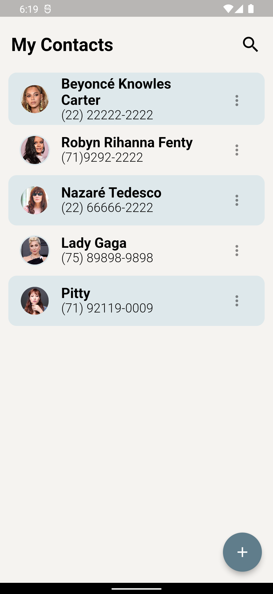
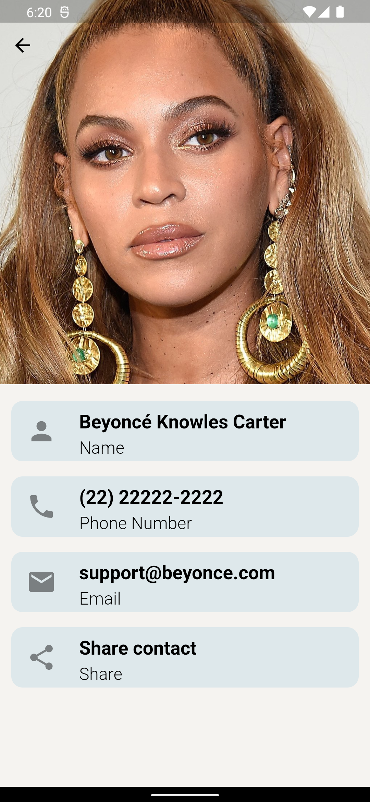

# ☎️ Contact Book
## Sobre o projeto

O aplicativo realiza operações CRUD (Create, Read, Update, Delete) para contatos, armazenando os dados com o serviço [Back4App](https://www.back4app.com). 
Isso permite aos usuários criar novos registros de contatos, atualizar informações existentes e excluir entradas quando necessário.

## Screenshots

   
  

### Tecnologias utilizadas

* Flutter
* Bloc
* Back4App

### Checklist do Desafio
Criar uma aplicação Flutter​ ✅
Criar um banco de dados / Back4App​ ✅
Fazer um cadastro de pessoa com foto de perfil​ ✅
Salvar apenas o path da imagem na base de dados​ ✅
Listar as pessoas em uma lista com sua respectiva foto​ ✅
Usar os outros componentes aprendidos ✅

### Desenvolvedora

<a href="https://www.linkedin.com/in/jusy-lopes/" > 

  
